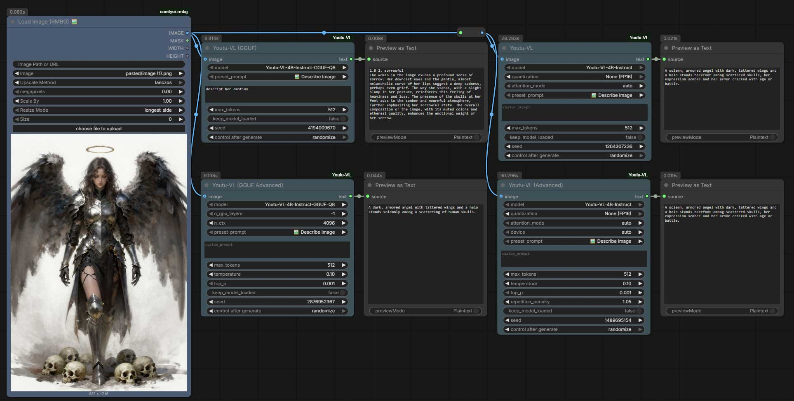

# ComfyUI-Youtu-VL

ComfyUI custom nodes for Tencent Youtu-VL vision-language model.
Youtu-VL is a lightweight yet powerful 4B parameter VLM with comprehensive vision-centric capabilities including visual grounding, segmentation, depth estimation, and pose estimation.


[Workflow](example_workflows/Youyu-VL.json)

[](https://github.com/1038lab/ComfyUI-Youtu-VL/blob/main/LICENSE)
[](https://www.python.org/)
[](https://github.com/comfyanonymous/ComfyUI)

---

## ✨ Key Features

- **🔥 Dual Engines**: Run with standard `transformers` (high precision) or `llama.cpp` (high speed/low VRAM).
- **🚀 Efficient & Lightweight**: 
  - Run **FP16/BF16** reference implementation.
  - Or use **4-bit/8-bit GGUF** to run on consumer GPUs (6GB+ VRAM).
- **🧠 Smart Vision Tasks**:
  - **Detailed Captioning**: Generate rich, descriptive prompts for Stable Diffusion.
  - **Tag Generation**: Auto-tag images for LoRA training.
  - **OCR**: Extract text from images.
  - **Visual QA**: Chat with your images.
- **⚡ Zero-Config**: Models auto-download on first use.

## 📦 Installation

### Method 1: ComfyUI Manager (Recommended)
Search for `ComfyUI Youtu-VL` in the Manager (Publisher: **1038lab**) and click **Install**.

### Method 2: Manual Install
Clone this repo into your `custom_nodes` folder:

```bash
cd ComfyUI/custom_nodes/
git clone https://github.com/1038lab/ComfyUI-Youtu-VL.git
cd ComfyUI-Youtu-VL
pip install -r requirements.txt
```

### 💡 Enable GGUF Support (Optional)
To use the GGUF nodes for faster inference:

```bash
pip install llama-cpp-python --extra-index-url https://abetlen.github.io/llama-cpp-python/whl/cu121
```
*(Replace `cu121` with your CUDA version, e.g., `cu118` or `metal` for macOS)*

---

## 🧩 Node Options

### 1️⃣ Youtu-VL (Standard)
*Best for precision and research.*
- **Model**: Automatic download from HuggingFace (`models/LLM/Youtu-VL`).
- **Quantization**: Built-in 8-bit/4-bit loading (via BitsAndBytes).
- **Attention**: Supports Flash Attention 2 for speed.

### 2️⃣ Youtu-VL (GGUF)
*Best for speed and daily usage.*
- **Model**: Loads `.gguf` files (Q4_K_M, Q8_0, F16).
- **Speed**: Extremely fast CPU/GPU hybrid inference.
- **VRAM**: Adjustable GPU offload layers.

---

## 🎮 Capabilities & Presets

The nodes include smart presets (in `config.json`) to automate common tasks:

| Preset Mode | Description |
| :--- | :--- |
| **📝 Detailed Description** | Writes a full paragraph describing lighting, composition, and subjects. |
| **🔍 Analyze Elements** | Lists key objects and layout details. |
| **🏷️ Generate Tags** | Creates comma-separated tags (Danbooru style). |
| **📄 OCR Text** | Reads and outputs visible text. |
| **🎨 Art Style** | Identifies medium, artist style, and technique. |
| **❓ Visual QA** | Ask custom questions like "What color is the..." |

---

## 🛠 Troubleshooting

- **GGUF Node missing?** -> Make sure `llama-cpp-python` is installed successfully.
- **Out of Memory?** -> Switch to the **GGUF** node and select a **Q4** or **Q5** model.
- **Experimental Nodes**: Segmentation, Depth, and Pose nodes are currently in the `Beta/` folder.

---

## 📄 License

- **Extension Code**: Licensed under the **GPL-3.0 License**. Copyright © 2024 **1038lab**.
- **Youtu-VL Model**: Licensed under the **License Term of Youtu-VL** by Tencent.
  - *Important: The model is NOT intended for use within the European Union and is subject to specific usage terms.*
